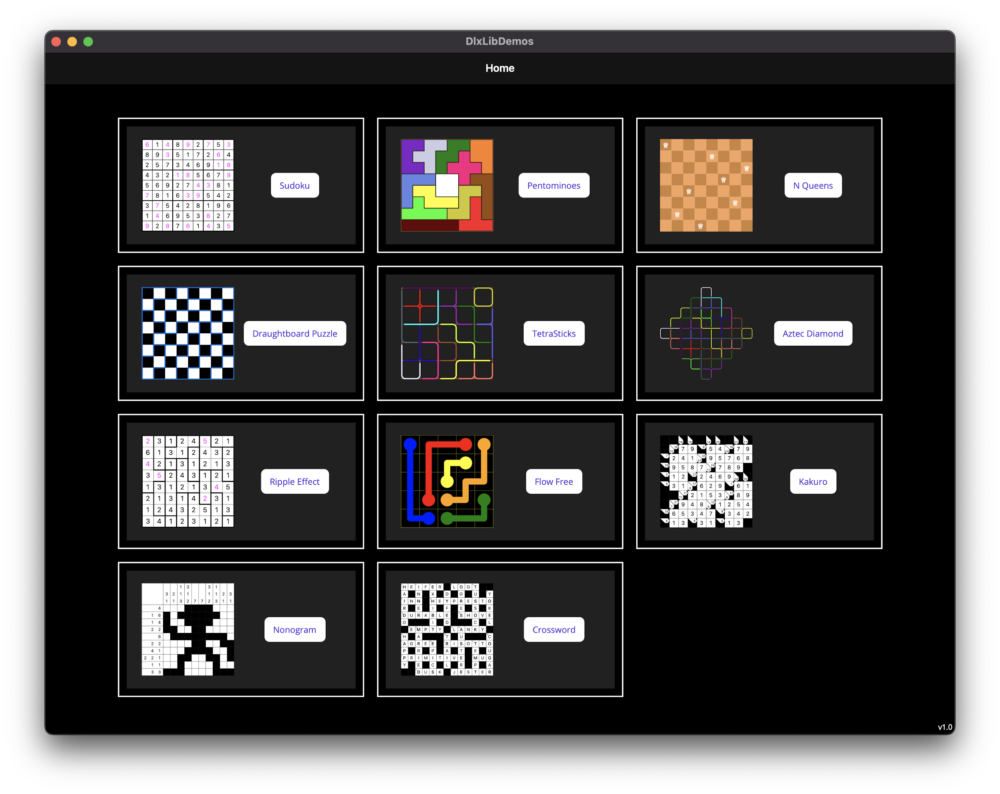
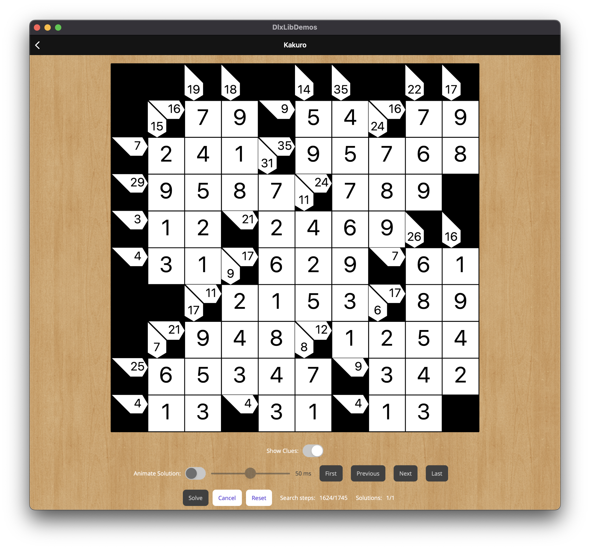

# Description

A few years ago, I created an implementation of
Donald Knuth's [Algorithm X](https://en.wikipedia.org/wiki/Knuth%27s_Algorithm_X)
using [Dancing Links](https://en.wikipedia.org/wiki/Dancing_Links).
My [DlxLib](https://github.com/taylorjg/DlxLib) implementation is available on [NuGet](https://www.nuget.org/packages/DlxLib).
I also wrote a bunch of WPF demo apps.

I have not had a Windows machine for many years - I have been using a MacBook Pro.
But, now that we have [.NET MAUI](https://learn.microsoft.com/en-us/dotnet/maui),
the idea of this repo is to convert these WPF demo apps to .NET MAUI and bring them all together in a single app.

Here are links to the existing WPF demo apps:

* [Sudoku](https://github.com/taylorjg/SudokuDlx)
* [Draughtboard Puzzle](https://github.com/taylorjg/DlxLib/tree/master/DlxLibDemo3)
* [TetraSticks](https://github.com/taylorjg/TetraSticks)
* [Ripple Effect](https://github.com/taylorjg/RippleEffectDlx)
* [Flow Free](https://github.com/taylorjg/FlowFreeSolverWpf)

# Screenshots






# TODO

* Convert/create demos:
  * ~~Sudoku~~
  * ~~Pentominoes~~ (new - no old WPF counterpart - but I do have a web version [here](https://github.com/taylorjg/pentominoes))
  * ~~N Queens~~ (new - no old WPF counterpart)
  * ~~Draughtboard Puzzle~~
  * ~~TetraSticks~~
  * ~~Aztec Diamond~~ (new - no old WPF counterpart)
  * ~~Ripple Effect~~
  * ~~Flow Free~~
  * ~~Kakuro~~ (new - no old WPF counterpart - but see [here](https://github.com/taylorjg/kakuro))
  * Nonogram (new - no old WPF counterpart)
  * Self Visualisation (new - no old WPF counterpart - but I do have a web version [here](https://github.com/taylorjg/dlxlib-self-visualisation))
* ~~Display version information~~
* ~~Do the solving on a background thread~~
* ~~Find all solutions and provide a mechanism to navigate between them~~
* Add an About page
* Add an app icon
* Add unit tests (made a start)
* Deploy to Google Play Store
* Deploy to Apple App Store
* Release a new version of DlxLib targeting `net6.0` (or `net7.0` ?)
* Create new documentation for DlxLib e.g. GitBook ?

# Running on macOS

```
dotnet build DlxLibDemos --framework net6.0-maccatalyst --target:run
```

# Links

* [DlxLib](https://github.com/taylorjg/DlxLib)
* [.NET Multi-platform App UI documentation](https://learn.microsoft.com/en-us/dotnet/maui/)
* [.NET MAUI API Reference](https://learn.microsoft.com/en-us/dotnet/api/?view=net-maui-6.0)
* [Community Toolkits Documentation](https://learn.microsoft.com/en-us/dotnet/communitytoolkit/)
